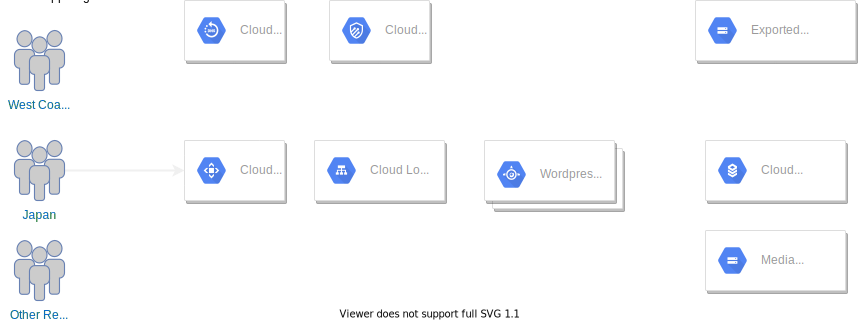

# WordPress Architecture

## Google App Engine
Google App Engine is excellent choice for hosting WordPress.  It provides an easy method to host an application with minimal maintenance needed.  It can automatically scale based on load.  By using a fully managed service, developers so not have to be concerned with infrastructure details like patching, scaling and availability.  More details can be found [here](google-app-engine.md).

## Google Cloud SQL
WordPress requires a database to store page and configuration data.  Google Cloud SQL for MySQL provides an easy was to provide those services without having to create a highly available SQL configuration yourself.  More details can be found [here](cloud-sql.md)

## Architecture

## Component Details
[Cloud CDN](cloud-cdn.md) 
[Cloud Armor](cloud-armor.md) 
[Cloud Load Balancing](cloud-load-balancing.md) 
[Google App Engine](google-app-engine.md) 
[Cloud SQL for MySQL](cloud-sql.md) 
[Cloud Storage](cloud-storage.md) 
[Cloud Storage for SQL Backup](cloud-backup-storage.md) 

## References
[WordPress on Google Cloud](https://cloud.google.com/WordPress/)